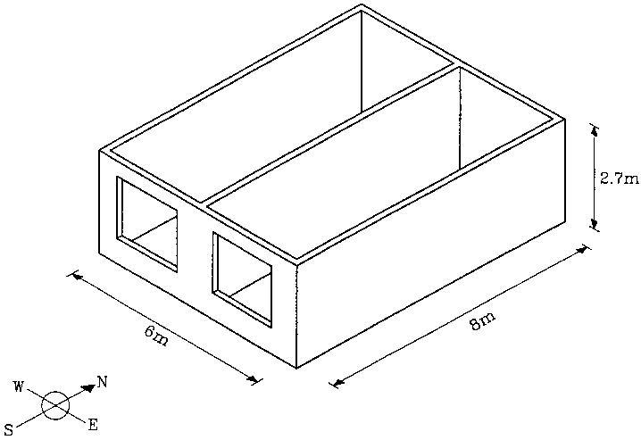
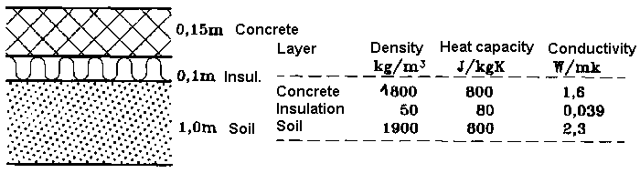

<link rel="stylesheet" href="../style.css">

# Learning examples
This chapter gives examples of the practical use of BSim, right from guidance as to how the program is started to how data must be entered in the individual menu fields.

By means of 3 examples, the model's structure is described as well as simulation and processing of results as an ongoing process for the same building model, so that most aspects of using the program are explained step by step.

A more summarized description of the individual steps of creating a [building model](https://bsim.outseta.com/support/kb/articles/y9q8azQA/opbygning-af-model) is found as a ordered row of links to pages in this User's Guide.

In order to enable the user to become acquainted with the most important functions of the program, a simple building is used as an example, for which a BSim-model is gradually built up. This means that not all the details of the program are described by examples. For a more detailed explanation of the individual parts of the building model, e.g. subjects which are not dealt with here, reference should be made to the description of the individual dialogs as well as [The mathematical basis](https://bsim.outseta.com/support/kb/articles/BWzd4NQE/det-matematiske-grundlag).

 

#### **The three examples**
The examples describe how the building model can be gradually built up, how the model is checked, how simulations are prepared and carried out as well as how the results can be analysed.

[EX1](https://bsim.outseta.com/support/kb/articles/ZmNrg7m2/eksempel-1)    Starting up BSim, typing in data for zones and surfaces, constructions and windows, copying data as well as saving the model and concluding BSim.

[EX2](https://bsim.outseta.com/support/kb/articles/7mawgK9E/eksempel-2)    Reading a pre-existing model, defining systems and schedules, setting up parameter lists as well as the first simulations and processing of simulation results.

[EX3](https://bsim.outseta.com/support/kb/articles/4966l79X/eksempel-3)    Further elaboration of the building model, addition of shadows, modification of glazing type and addition of solar shading devices and ventilation systems. New simulation, modification of hour-log, analysis of results, and comparison with earlier results, definition of parameter lists, print-outs in tables and graphics.

When going through the examples it is a assumed that the user has read the section regarding the [central user interface (SimView)]()

and can use the mouse and keyboard confidently

 and have knowledge of the use of programs in the MS-Windows operating system.) and can use the mouse and keyboard confidently and have knowledge of the use of programs in the MS-Windows operating system.

#### **Example 1 - Description of the building**
The "physical" building, for which a model is constructed, is very simple as it is basically a box-shaped building, limited by 4 walls orientated towards the four compass orientations, with 2 windows in the south wall, a flat roof and a slab on ground floor. The figure below shows a sketch of the building's form.

<figure id="center_img">

<figcaption>Sketch of building, for which a model is built up in the examples in this chapter.</figcaption>
</figure>

Even though there are two rooms in the building, it is counted as one zone in this example, as it is assumed that there is no great difference in the conditions in the two zones. The building thus consists of one zone with inside measurements 6 m x 8 m, with one short side facing south, cf. figure below. The internal height of the room is 2.7 m.

<figure id="center_img">

<figcaption>Plan of the building for the examples.</figcaption>
</figure>

####  **Boundary conditions**
For the outdoor climate, data from the [Danish Design Reference Year](https://bsim.outseta.com/support/kb/articles/A93zbqQ0/litteratur), DRY are used, from which the necessary weather parameters are found in BSim format in the file named CPH.DRY.

As regards all external walls as well as the roof, one side faces the outdoor air. The floor is in contact with a virtual zone (the ground) with a fixed temperature of 10 °C.

The reflectance of solar radiation from the surroundings is 0.20. The external surfaces of the building have an absorption coefficient for solar radiation of 0.7.

**Surface resistances**  
The internal surface resistance is set to 0.13 m² K/W and the external surface resistance towards the outdoor air to 0.04 m² K/W, cf. the [Danish Standard DS 418](https://bsim.outseta.com/support/kb/articles/A93zbqQ0/litteratur), whilst the surface resistance towards "deeper earth layers" is reckoned to be 1.0 m² K/W.

 

#### **Outer walls**
All outer walls have the same construction with layers as described in the figure below. When describing the layers in the constructions it is important to notice that the layers are described so that the first layer faces towards face 1 and last layer towards face 2.

<figure id="center_img">

<figcaption>Description of constructions in all outer walls.</figcaption>
</figure>

Standard libraries for constructions, glazing types, materials etc. is delivered together with the BSim program in the standard database (SbiData.mdb), and in an given example it will often be possible to define components and building parts simply by making a reference to the database.

In the current example, the building library does not include a construction type identical to the one specified, and it will therefore be necessary to set up the construction locally in the building model. In order for this to be practicable it is recommended that the accompanying materials library should be used. Building up the actual construction is described in example 1.
 

#### **Internal walls**
Lengthwise in the building (North-South), a wall is placed in the middle, the whole length of the room, i.e. 8 m. In practice, the building is thus divided into two rooms, but the two zones are reckoned to be so uniform from a thermal point of view that they can be considered as one zone.

The wall is a one stone brick wall with a thickness of 0.108 m and one layer of material "Brick int 1400" from the standard material database.

 
#### **Floor construction**
The floor, as shown in the figure, consists of 150 mm concrete over 100 mm rockwool, class 39. For this example only a simplified calculation of the heat loss to the ground is performed, the ground being assumed to have a fixed temperature of 10 °C the whole year. A 1.0 m layer of earth is included with the floor and a value of 1.0 m² K/W is assumed for surface resistance to deeper layers.

<figure id="center_img">

<figcaption>Description of the floor construction.</figcaption>
</figure>

#### **Ceiling construction**
The roof is a cassette construction which on the inside consists of 22 mm pine wood lists with 150 mm insulation class 39 and the outside consists of 22 mm wood with roofing felt. In this case, the outermost thin layer is disregarded, so the construction only has 2 layers. The construction described is to be found as a standard construction type as a roof construction which will normally correspond to ventilated ceiling/roof with wooden trusses.

 

#### **Windows**
Two identical windows are to be found in the south wall, placed as shown in the figure below. The window pane is an ordinary air-filled double glazed low energy pane, and the frame is asumed to be a 100 mm wooden frame the whole way round. The U-value for the total window construction is 1.6 W/(m²K).

The window is recessed slightly from the facade, so that the window's exterior surface lies 0.1 m deeper than the facade. This is being described via the entry *Overhang/sidefins* in the Windoor property dialog.

<figure id="center_img">

<figcaption>Location of windows in the South facade.</figcaption>
</figure>

#### **Other data for the example**
The structural part of the model can be defined in BSim on the basis of the description above. Remaining data for the systems, solar shading, shadows etc. are described in [example 2](https://bsim.outseta.com/support/kb/articles/7mawgK9E/eksempel-2).
