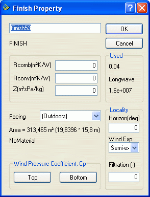

<link rel="stylesheet" href="../style.css">

# Example 1

#### **Start BSim**

The program is started by clicking BSim through the menu entries *Start* | *Program Files* | *BSim* | *BSim*.

By doing this the common user interface - the main window - ([SimView](https://bsim.outseta.com/support/kb/articles/wQXx2xQK/simview)) is shown. The main window is divided into two fields, which are empty for the time being. In the field to the left the actual building will be shown as a tree structure. The field to the right will be further divided into four fields, where the model will be shown graphic. The preliminary name for the building model is 'untitled', as shown in the title bar of SimView.

Before starting the work on constructing a building model, it is a good idea to set the parameters for saving *Undo*-levels for changes in the model geometry. This is done by right-clicking in the graphic part of the main window and selecting the entry [*Options*](https://help.bsim.dk/support/kb/articles/LmJv8EmP/simview---options). Please note that changes in the number of *Undo*-levels will <u>not</u> come into action until the next time the program is started.

To create a new model, the mouse pointer is moved to the menu *File* | *New*, and clicking the mouse (left mouse button). One can also click the icon for a new project (the first (from left) icon at the [tool-bar](https://help.bsim.dk/support/kb/articles/E9Lw5nQw/simview---varktojsbjalken)) or alternatively by pressing *Ctrl+n* as a [short-cut](https://bsim.outseta.com/support/kb/articles/vWyPMJ9b/genvejstaster).

<figure id="center_img">

<figcaption>First dialog for creating a new project.</figcaption>
</figure>

Doing this calls upon a [wizard](https://help.bsim.dk/support/kb/articles/yWogPPWD/model-wizard---oprette-en-ny-model) for creation of a new model. The name (top input line) and the path (bottom input line) to the new model must be given in the first dialog box. The The name of the new model is typed in the name field, in this case 'EX1'. In the path field the following can be typed:

C:\Program Files\Statens Byggeforskningsinstitut\BSim\Models

If the folder specified as *C:\Program Files \Statens Byggeforskningsinstitut\BSim\Models*, does not exist, the program will create a new folder of the given name. This can be used to save the different examples described in this sections of the User's Guide. It is also possible to search through the file system of the PC for the appropriate location to store the model files. This is done by clicking the  -button.

The wizard creates a copy of the database selected in the second dialog box. The copy can for instance be created based on the standard database (SbiData.mdb) delivered with the program and will get the same name as the name of the model. The copy will, in contradiction to the standard database, not be write-protected.

Beside creating a copy of a base-database it is possible to select what building type to model in the third wizard dialog box (*Office or Dwelling*). Making this choice a number of typical time and load profiles that can be used in the definition of the systems in the model.

 

#### **The building and the spaces in it**

Now we are ready to describe the building geometry and the spaces in the building to the program. Right-click in the graphic part of the main window and select the entry *Add Building* (or Alt+b) from the [SimView menu](https://help.bsim.dk/support/kb/articles/49EdrJQ7/simview---menu). This calls upon the building dialog. By creating a new model, it will be most natural to start the description with the spaces of the building that are to be simulated, and gradually describing the model in more and more detail, say construction types, layers in constructions and materials of the individual layers.

<figure id="center_img">

<figcaption>Dialog for creating a new building.</figcaption>
</figure>

**Automatic assignment of names**

All building objects, created during the creation of the model, will automatically be assigned a name. The names are solely to ease the identification of the objects to the user. By editing the data, it is always possible to change the automatic names to something more meaningful. It is strongly recommended to take the opportunity to give good names to any object as this will ease the result handling significantly.

 

**Numerical values for spaces in example 1**

On the basis of the building description, the numerical values shown can be defined and typed into the building dialog. "EX1" is typed in as a new name for the building, and for the first space "Box-room 1" is typed. Data for the size of the space (the system lines) in the X-, Y- and Z-directions are given as: 3.358, 8.616 and 4.32 respectively. The X, Y and Z values corresponds to the size of the space plus the thickness of the constructions. Beside this, the location of the building in the coordinate system (X, Y, Z origin), can be given including an eventual rotation of the building from direct North (positive towards East). The coordinate origin is located in (0, 0, -1), which places the bottom of the floor construction in contour 0.

 

**NOTE:** The thickness of exterior constructions are located from the system lines and in. Internal constructions are located symmetric around the system lines.

The filling in of the building dialog is now complete, and it is closed by clicking the OK-button.

<figure id="center_img">

<figcaption>Main window after initial creation of the building and the first space.</figcaption>
</figure>

The building is now shown as a wire-frame drawing in the graphic part of the main window. In the left field the building is shown as a hierarchical tree structure, starting with the building and underneath the spaces of the building. In each space all faces (walls) surrounding the space are shown. For each face, the selected constructions and the spaces on each side are shown. Finally on each side the material properties for the surfaces of each face side are shown. By right-clicking an object in the tree structure the property dialog of that object is shown.

In the graphic part of the main window the building is shown as a wire-frame drawing in four different ways. At the bottom left a plan (XY) is shown. At the top two sections are shown, left facing the Y-direction (XZ) and right facing the X-direction (YZ). In the bottom right field a 3D drawing is shown.

The drawings can be zoomed in or zoomed out by clicking the magnifying glass icon of the tool-bar. The view direction of the 3D drawing can be altered by pressing the arrow icons at the tool-bar or on the keyboard.

In the 3D drawing it is possible to control-click (left click on the mouse while the Ctrl-button is pressed) on an edge of a face. Doing this will select one of the faces sharing the edge and mark it using a red color. The corner points (vertexes) are marked by black boxes, and the face is located in the tree structure. Repeated ctrl-click on the edge will select the next face sharing the same edge.

 

**Input of data for windows**

Select the face (Ctrl+left-click) facing South (if convenient rename it to 'SouthWall'). Select a local origin (double left-click or Shift+left-click one of the vertexes) of a coordinate system in the face where the window is to be inserted. Select an axis (double left-click or Shift+left-click on an edge) in the local coordinate system. Open the [SimView-menu](https://help.bsim.dk/support/kb/articles/49EdrJQ7/simview---menu) and select the entry *Add WinDoor* to define the geometry and the location of the window in the WinDoor dialog.

<figure id="center_img">

<figcaption>Dialog for adding windows and doors (WinDoor) to a face. The illustration at the bottom right of the dialog shows how the WinDoor is located in the local coordinate system.</figcaption>
</figure>

The width of the window opening is 2.0 m and the height 2.25 m. The distance from the floor (*Offset*) is 1,55 m (floor thickness + 30 cm distance from floor surface to bottom of the window) and the distance from the side wall (*Dist.*) is 0.808 m (exterior wall thickness + distance from the wall). The standard value 1 for number of windows and 0.2 for distance between identical WinDoors should no be changed in this example.

To define the geometry around the window in detail, right-click the object WinDoor in the tree structure and the WinDoor property dialog will open. In this dialog the local geometry (recess, overhangs and sidefins), systems connected to that WinDoor and solar light factors can be defined. Type 0.1 meter for the recess of the glass compared to the outer surface of the facade. The dialog is closed by clicking the the OK-button.

<figure id="center_img">

<figcaption>Dialog (WinDoor Property) for definition of local geometry, systems and solar light factors for a windoor. A stop sign will occur if no WinDoor construction is attached.</figcaption>
</figure>

Now the second space of the model can be created as a copy of "Box room 1". The new space can be created by selecting a face of the existing space and adding the new space to this using the entry *Add Room* from the [SimView-menu](https://help.bsim.dk/support/kb/articles/49EdrJQ7/simview---menu). The size of the new space and/or the standard geometry can be chosen in the *Add Room* dialog box.

<figure id="center_img">

<figcaption>Add a space (Box room 2) to the model.</figcaption>
</figure>

The new space is created as a copy of the current space. Doing this, the entire geometry (incl. windows, doors and eventual openings) of the space as well as all defined construction types will be copied to the new space.

 

#### **Constructions and construction types**

Not all the construction types described in the example exists in the standard database, and it is therefore necessary to create new elements in the model database.

 

**Connection of new constructions to the model database**

From the [building description](https://help.bsim.dk/support/kb/articles/BWzd7LQE/indlaringseksempler) it emerges that the external wall construction is lightweight concrete, insulation and bricks. This construction type does not exist in the copy of the standard database, but a type with only one material layer differing from the desired type ('Br 39I100 Br'). The mouse cursor is moved to the SfB-number of the type with the mane 'Br 39I100 Br', which is a double brick wall with 100 mm insulation in between the two brick leafs. The construction type needed consists of light weight concrete as the inner leaf and it is therefore necessary to change one of the material layers.

 

**Copying database elements**

It is always recommended to make a copy of the element to change, in this case the construction type 'Br 39I100 Br'. By clicking the button *Copy*, the dialog shown below is revealed.

<figure id="center_img">

<figcaption>Dialog (Copy BuildingElement) for giving a unique SfB-number to a copy of a building element.</figcaption>
</figure>

When the new building element have got an unique SfB-number the *Edit BuildingElement* dialog of the database will open. On the first tab (*BuildingElement*) the name of the construction is changed so it reflects the new construction. After this one should jump to the second tab (*ConstructionLayer*). To obtain a description of the input fields in [*BuildingElement*](https://help.bsim.dk/support/kb/articles/dQG2dzm4/simdb---buildingelement), [*ConstructionLayer* ](https://help.bsim.dk/support/kb/articles/OW4NdAQg/simdb---buildingelement-constructionlayer)and [*MaterialAmount* ](https://help.bsim.dk/support/kb/articles/Rm8JaZ94/simdb---buildingelement-materialamount)please refer to the description of the database SimDB.

<figure id="center_img">

<figcaption>On the second tab (ConstructionLayer) in the dialog Edit BuildingElement the material layers in the construction can be changed.</figcaption>
</figure>

Lightweight concrete is found in the BuildingMaterial part of the database, to where there is access on the second tab. By clicking the third material layer (*Brick ext 1800*) the layer is selected. In the entry *Type* the group f is selected (*Precast elements*), and from the entry *ConstructionMaterial* the appropriate (matching the [description of the constructions](https://help.bsim.dk/support/kb/articles/BWzd7LQE/indlaringseksempler)) material is selected to replace the current material.

When a new material is selected instead of the internal brick leaf, the thickness must be changed to 0.1 m. This is done by selecting the layer (left click on the mouse) and changing the value in the second field, immediate under the selection menu for *ConstructionMaterial*. The new material layer thickness will occur in the column marked *Thickness* beside the name of the new material.

The order of the layers is given as the parameter (0 -> n) in the last column, where 0 indicates the layer at side 1 of the construction (normally towards the space) and n, the layer at face 2 of the construction.

The parameter *resistance* gives the thermal resistance in m²K/W of eventual enclosures in the construction. The thermal resistance of an enclosure is given on the material located closer to side 1 of the construction compared to the enclosure.

 

**Constructions in floor and roof**

The [floor construction](https://help.bsim.dk/support/kb/articles/BWzd7LQE/indlaringseksempler) does not exist in the copy of the standard database, but looks like the construction 'C150 39I100', with an addition of 1 m and humid soil as the last material layer of the construction. With the cursor on the construction 'C150 39I100' the *Copy* button is clicked to make a copy of the standard construction.

As described for external walls a copy is created and the layers can be changed. On the *ConstructionLayer* tab the cursor is moved to the second material layer, 'Min. wool 39', and the button *New Layer* is clicked. Doing this, a new material layer with the name? is created and the same procedure as described above can be used to define the material layer humid soil. Soil(humid) is found in the material group k, *Soil Materials*.

 

**Roof constructions**

A the roof construction the type '*Roof constr.*' from the copy of the standard database can be used.

 

**Internal walls and heat capacity**

The walls are important for the total heat capacity of a space and thereby the temperature variations, the utilization of free gains and the energy consumption. In light spaces where the constructions have little heat capacity, furniture etc be of importance for the total heat capacity of the space and it will therefore be necessary to include this kind of thermal masses.

 

**Windows**

In the building description is given that the U-value is 1,6 W/m²K, but no information about the type of frame is given. From the database the window type '*LavE i træramme*' can be used.

 

#### **Attachment of constructions to faces of the model**

From the tree structure it is evident that no construction types nor WinDoor types have been selected, as these objects all have the type '*No Type*'. To define how the individual faces, i.e. the North wall, are constructed the SimView menu is opened (right-click with the mouse in the graphic part of the main window) and selecting the entry *Defaults*. Doing this the dialog for definition of [standard constructions](https://bsim.outseta.com/support/kb/articles/y9gBKGQM/standardkonstruktioner) is shown.

<figure id="center_img">

<figcaption>Double dialog for selection of standard constructions and WinDoors for all faces of the model.</figcaption>
</figure>

A construction type can be attached to the faces of the model by dragging the appropriate SfB-number while pressing the left mouse-button to the right position in the *Defaults* dialog.

The desired construction type can be selected from different groups of data in the [database](https://bsim.outseta.com/support/kb/articles/y9q842QA/databasen-simdb).

<figure id="center_img">

<figcaption>The database constructions (BuildingElements) are divided into different types, i.e. external walls , internal walls, floors etc.</figcaption>
</figure>

When all relevant constructions have been attached in the *Defaults* dialog, the *OK* button is clicked. Changes will not come into action until the building property dialog (right-click the building in the tree structure) and the button *Insert Defaults* has been clicked.

<figure id="center_img">

<figcaption>Properties for the building (Building Property). The dialog is opened by right-clicking the building in the tree structure. Standard constructions are attached the constructions by clicking the Insert Defaults button.</figcaption>
</figure>

Clicking the *Insert Defaults* opens the following dialog:

<figure id="center_img">

<figcaption>Constructions are divided into the shown groups (Insert Default Options). Only those groups marked with a "tick", will be updated/overwritten with the selected standard constructions.</figcaption>
</figure>

When the constructions are given a type, they will be drawn in the 3D drawing with their real thickness.
 

#### **Climate data and virtual zones**

In the example the floor faces the ground under the building, which in this case is defined as a virtual zone. This is done by right-clicking the building in the tree structure to show the building property dialog. Click the button *Site* to open a dialog for definition of climate data and virtual zones.

<figure id="center_img">

<figcaption>Dialog (Site) for selection of climate data and definition of the virtual zone ground.</figcaption>
</figure>

To define a (new) location (*Site*) of the model, the *New* button is clicked. This creates a new *Site* and it is possible to select a climate data file by clicking the *Browse* button. Browse and select the climate data file *cph.dry*.

Click the *Ground* button and then the *New* button in the *Ground* dialog to create the [virtual zone ground](https://bsim.outseta.com/support/kb/articles/vWyP8M9b/klimadata) with a constant temperature of 10 °C all year through.

<figure id="center_img">

<figcaption>Dialog (Ground) for definition of the temperature variation of the virtual zone ground during the year.</figcaption>
</figure>

In the control of the virtual zone ground a temperature variation over the year can be given as a sinus curve defined by its maximum value and its minimum value and the date for the maximum temperature. An analogue variation can be used for the moisture content of the air in the virtual zone ground. The values 10.0 as maximum temperature and 10.0 for minimum temperature are used. This corresponds to a constant temperature of 10 °C during the whole year. Using the same value as maximum and minimum temperature the information in the date field becomes unnecessary. The standard value 0.0058 (kg/kg) is used for the humidity of the air in the virtual zone ground (in this case without meaning). For a simple and rapid simulation, or in cases where the heat loss to the ground are insignificant, a constant ground temperature can be used.

In this example the floor faces the ground and to input this in the model, right-click *Finish* no. 2 for the floor in the tree structure and select that the second face of the floor faces towards the newly created virtual zone Ground via a selection in the field *Facing*.

<figure id="center_img">

<figcaption>Dialog (Finish Property) for selection of what is on side two of a face. It is <u>only</u> possible to change this parameter for surface 2 of a construction.</figcaption>
</figure>

In the *Finish Property* dialog a field with information about the combined (convection and radiation) surface resistance (*Rcomb*) for the actual surface is found. The standard value for *Rcomb* is 0, which means that the program determine if the surface is facing outdoors or indoors and gives the standard values 0.13 or 0.04 m²K/W on the internal and external surface respectively. If the standard value is changed, the program is no longer able to change the values if the surface goes from being internal to external or vice versa, i.e. by adding an atrium to the building model.

 

**Virtual zone 'As thermal zone'**

A virtual zone can also be created as a new space which is physically connected to the space in the model where it is to be used. Spaces outside thermal zones do not need to have defined constructions for all faces. A space can have a pre-defined temperature and humidity variation over the year - like the ground - and can further have a variation over the day.

Instead of attaching a space as a virtual zone, it is possible to define that the temperature and moisture conditions on the other side (side 2) of a wall is the same as in the thermal zone of side 1. This can be done by right-clicking the *Finish* of the face 2 and selecting that this face faces (*Facing*) the thermal zone itself. A more detailed description of this can be found in the description of [virtual zones](https://help.bsim.dk/support/kb/articles/EWBOKNmr/simview---fiktive-zoner).

 

**More accurate calculation of heat losses to the ground**

For a more accurate calculation, the principles in the rules of [DS 418](https://bsim.outseta.com/support/kb/articles/A93zbqQ0/litteratur) for estimation of the insulation value of the ground, eventually simplified that heat losses from basement walls under the ground surface and the slab on ground field 0-1 m from the internal side of an external wall, is calculated to the outdoor air through a 1 meter thick layer of soil with a thermal resistance of 1,0 m²K/W, while the heat loss from basement floors and the centre field of the slab on ground - more than 1 meter from the internal side of external walls - is done through the soil resistance of 2.0 m²K/W. The temperature under heated buildings (20 °C) depends especially on the insulation level of the floor and the size of the building. Normally this can be approximated to vary as a sinus shaped curve with its lowest temperature (10-12 °C) at the end of the winter (February-March) and the maximum temperature (14-16 °C) in the end of the summer (August-September).

 

**Control of the model data**

Now data for a simple building model, comprising two thermal zones, each surrounded by six faces and it is now sensible to save the model. Before saving the model it should though be checked if there is any bugs in the model of data is missing. To do this, click on the [*ModelList* ](https://help.bsim.dk/support/kb/articles/ZmNr2Em2/simview---udskrift-af-model)button in the [tool-bar](https://help.bsim.dk/support/kb/articles/E9Lw5nQw/simview---varktojsbjalken). If any data is missing or any other errors are found, the program will show a stop-sign at the beginning of the line with a description of the faulty object. It is possible to jump directly to most of the faulty objects by double-clicking the stop-sing in the model list. The list is removed by clicking the **x** in the right end of the title bar of the model list window.

 

#### **Creating a thermal zone**

It is still not possible to carry out a tsbi5-simulation. To be able to do this, at least one [thermal zone](https://bsim.outseta.com/support/kb/articles/rm0x8ZmX/thermal-zone-property), containing at least one space, must be created.

Right-click on the building in the tree structure to open the building property dialog, which have a button for creation of thermal zones. Each click on the *Insert ThermalZone* button, adds a thermal zone to the model. In this case one thermal zone is required.

<figure id="center_img">

<figcaption>Dialog (Building Property) for adding thermal zones, climate data and default values for constructions, as well as defining the rotation of the building model and which (Current Building) building to simulate in tsbi5.</figcaption>
</figure>

It is possible to have more buildings in the same model, i.e. as shading objects, but tsbi5 can <u>only</u> simulate one building at the time (*Current Building*). Therefore a tick must be placed in the *Current Building* input field.

In the tree structure an icon for a thermal zone is now shown 

, but the thermal zone do not contain any spaces. Each of the two spaces in the model must now be drawn (with the left mouse button pressed) to the thermal zone and dropped here. Doing this the spaces are attached to the thermal zone and can be simulated in tsbi5.

 

#### **Save the model**

While creating large models it is advised recommend to save the model every now and then. This is done by the *Save* entry in the *File* menu (short-cut: Ctrl+s) or the *Save as* entry, which saves the model in a new name. Note that an automatic backup will be created each time one of these functions are used.

 

#### **Terminate BSim**

The description of input data for systems are found in [Example 2](https://bsim.outseta.com/support/kb/articles/7mawgK9E/eksempel-2), where you can continue directly. If the data input is to be ended here, click the *Exit* entry of the *File* menu or click the **x** at the right end of the title bar of the main window.

See also:
*   [Example 2 - The systems of the building](https://bsim.outseta.com/support/kb/articles/7mawgK9E/eksempel-2)
*   [Example 3 - Modifying the building model ](https://bsim.outseta.com/support/kb/articles/4966l79X/eksempel-3)

