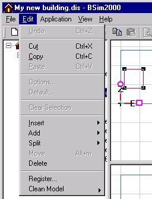

<link rel="stylesheet" href="../style.css">

# Edit

<figure id="center_img">

<figcaption>Edit menu (Alt-e).</figcaption>
</figure>

*   *<u>U</u>ndo*: Undoes the last major change in the model's geometry.

*   *Cu<u>t</u>*: Cuts out an element and stores it on the PC's clipboard for subsequent pasting in another place. This function should be used with care.

*   *<u>C</u>opy*: Copies an object and stores it on the PC's clipboard for subsequent pasting in another place. This function should be used with care.

*   *<u>P</u>aste*: Inserts the contents of the clipboard.

*   *Options*...: Opens the [dialog box](../09SimView/09_16_SimView_Options.md) for changing the software settings. If tsbi5 is active a [dialog for viewing and changing standard parametres for tsbi5](24_16_tsbi5_general_options.md) is opened.

*   *Default*...: Opens a [dialog box](../10Thermal_zones\10_06_SimView_Default_constructions.md) for attaching default constructions and the database from which they are selected by holding the left mouse button down while dragging the construction to the *Default* dialog box.

*   *Clear Selection*: Deselects any objects selected in *SimView*.

*   *<u>I</u>nsert*: Inserts the following objects into the model:

    *   building(s) from another project. The function *Insert* | *Building* is used when defining [shadows](../10Thermal_zones/10_05_Shadows_from_the_surroundings.md) from the surroundings or when more than one storey are to be imported from [SimDXF](../08SimDXF_CAD_drawings_as_basis_for_geometry/08_01_CAD_drawings_as_a_basis_for_geometry.md) as CAD created geometry.

    *   WinDoors or Openings in selected faces.

*   Add: Opens a sub menu for:

    *   Allowing a new building,

    *   a [space](../09SimView\09_15_SimView_Creating_a_space.md) to the selecetd face,

    *   a face between selected points of a face,

    *   an edge between points of a face,

    *   a [WinDoor](../10Thermal_zones\10_08_SimView_Adding_an_opening_or_WinDoor.md) or an opening,

    *   a [PvArray](../16SimPV/16_02_Adding_solar_cells_to_the_model.md) BSim module similar to WinDoors.

*   *Split*: Opens a dialog box that allows:

    *   an edge to be split by creating a new point (vertex) in the middle of the edge,

    *   a face to be split between two selected points (vertexes).

*   *Move*: Opens a dialog box for [moving a face](../09SimView\09_13_SimView_Move.md) in parallel to the face's normal vector. 

*   *Delete*: Deletes a selected object from the model.

*   *Register*: Registers *.DLL and *.OCX files for use by *BSim*. This normally happens automatically during installation of the software suite.

*   *Clean Model*: Allows to choose between two functions to tidy the model:

    *   *Model* removes surplus infromation and objects from the model, *Geometry* cleans the gromerty i.e. by combining vertexes with a distance less than the "snap" distance (see [Options](../09SimView/09_16_SimView_Options.md)).