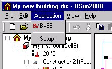

<link rel="stylesheet" href="../style.css">

# Application
<figure id="center_img">

<figcaption>Application menu (Alt-a).</figcaption>
</figure>

*   *Application name(s)*: A list of programs that can be started from *BSim*.

*   *Setup*: Opens a [dialog](24_19_Setting_up_applications.md) box for selecting programs that it should be possible to start straight from *BSim*. The programs will appear both in the *Application* menu and as buttons on the [toolbar](../06BSim_Program_structure\06_05_SimView_Toolbar.md)  in the group immediately to the right of the *tsbi5* icon.
