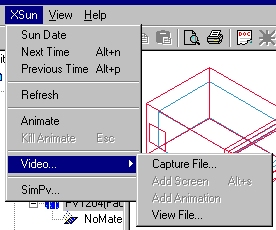

<link rel="stylesheet" href="../style.css">

# XSun
<figure id="center_img">

<figcaption>The XSun menu is only visible when XSun is active.</figcaption>
</figure>

*   *Sun Date* Opens a [dialog](../14XSun_Analysis_of_incident_solar_radiation/14_02_XSun_menu.md) for definition of the date and time to analyze the direct solar gains in the model.

*   *Next Time:* Changes the position of the sun one time step ahead (*defined in Hour Step*) when an eventual animation have been stopped - short cut: *Alt-n*

*   *Previous Time*: Changes the position of the sun to one time step earlier (defined in *Hour Step*) when an eventual animation have been stopped - short cut: *Alt-p*

*   *Refresh* updates the graphic view of the model.

*   *Animate*: Starts an animation of the location of the direct solar beam in the model, one time step at the time from dawn to sunset.

*   *Kill animate:* Stops an animation of the solar beam position in the model - short cut: *Esc.*

*   *Video*... shows a sub-menu with the entries:

    *   *Capture File*...: Opens a [dialog](../14XSun_Analysis_of_incident_solar_radiation/14_03_XSun_video.md) for selection of a name to a video-file to save the animation of sun beams and shadows.

    *   *Add Screen*: When a name for the video-file have been given the actual still picture can be saved in the video file using this command. The function can also be activated from the [XSun menu](../14XSun_Analysis_of_incident_solar_radiation/14_02_XSun_menu.md)

    *   *Add Animation:* When a name for the video-file have been given the animation is started and saved in the file using this command. The function can also be activated from the [XSun menu](../14XSun_Analysis_of_incident_solar_radiation/14_02_XSun_menu.md).

    *   *View File*... opens a dialog for opening and viewing a video-file.

*   *SimPV.*.. opens a [dialog](../16SimPV/16_01_SimPV.md) for calculation of the electrical yield from a building integrated PV-system.