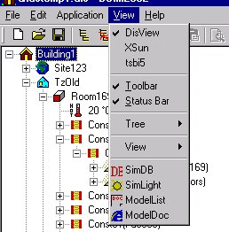

<link rel="stylesheet" href="../style.css">

# View

<figure id="center_img">

<figcaption>View menu (Alt-v).</figcaption>
</figure>

*   *DisView*: Switches to the program interface for [SimView](../09SimView/09_01_SimView.md) for model editing.

*   *XSun*: Switches to the program interface for [XSun](../14XSun_Analysis_of_incident_solar_radiation/14_01_Analysis_of_incident_solar_radiation_with_XSun.md) for calculating and visualising incident solar radiation and shadows.

*   *tsbi5*: Switches to program interface for [tsbi5](24_22_Thermal_simulation.md).

*   *<u>T</u>oolbar*: Shows or hides the [toolbar](../06BSim_Program_structure/06_05_SimView_Toolbar.md).
*   *<u>S</u>tatus Bar*: Shows or hides the status bar (the wide bar at the bottom of the program window that displays a brief explanation of the highlighted menu option).

*   *Tree*: Allows the view of the model in the tree summary (on the left of the program window) to be collapsed or expanded and the view of the model to be updated.

*   *View*: Gives access to a submenu with the following options:

    *   *Auto Scale*: Scales the view automatically.

    *   *Zoom In*: Zooms in on the model (shortcut: "+").

    *   *Zoom Out*: Zooms out so that the model is seen from further away (shortcut: "-").

    *   Viewpoint: Opens a submenu for changing the isometric view of the model (shortcuts: right arrow, left arrow, up arrow, and down arrow).

    *   Arrange: Arranges the view within the defined *Bounding Box*.

    *   *Expand* expands the area (the grid in the 3D view) shown.

    *   *Collapse* collapses the area (the grid in the 3D view) shown.

    *   Update: Forces the model view to be updated.

*   *SimDB*: Calls up the [database](../07SimDB_Database/07_01_The_SimDB_database.md).

*   *SimLight*: Switches to the program interface for [SimLight](../15SimLight_Daylight_calculations/15_01_Daylight_calculations_with_SimLight.md).

*   *ModelList*: Switches to the [model list](../06BSim_Program_structure/06_07_SimView_Printing_a_model.md) information view.

*   *ModelDoc*: Switch to the [model documentation](24_77_ModelDocumentation.md) view, sorted on buildings, thermal zones, rooms, faces, systems, schedules etc.