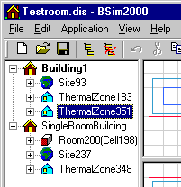
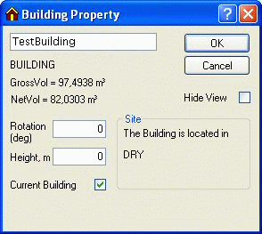

<link rel="stylesheet" href="../style.css">

# Termisk simulering
The thermal simulation of a buildings *thermal zones* is made in the *tsbi5* program. Simulations in *tsbi5* are carried out for the current building. If there is more than one building in the model ([shadows from surroundings](../10Thermal_zones\10_05_Shadows_from_the_surroundings.md)), the current building will be marked in bold types in the tree structure.

<figure id="center_img">

<figcaption>The current building is marked by bold types.</figcaption>
</figure>

The current building ca be selected by right-clicking the desired building and putting a mark in the *Current Building* box. This act removes the *CurrentBuilding* mark from any other building.

<figure id="center_img">

<figcaption>The Building Property dialog offers the opportunity of selecting the current building.</figcaption>
</figure>

*tsbi5* is a Windows-based successor *tsbi3* with some improvements and changes. Compared to *tsbi3* especially the introduction of a full 3D-geometry is a distinct change and the graphic representation of the model. Beside this minor changes have been made in connection with the control of ventilation systems and there can be calculated a temperature stratification in high rooms. Finally there has been established a connection to the [*XSun*](../14XSun_Analysis_of_incident_solar_radiation/14_01_Analysis_of_incident_solar_radiation_with_XSun.md)-program, which creates the possibility for more precise calculations of the solar distribution in a room.

The simulation program is started by pressing the icon for [*tsbi5*](../13tsbi5_thermal_simulation/13_01_tsbi5.md).