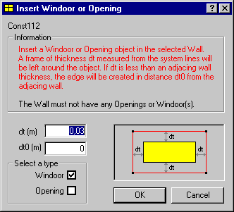

<link rel="stylesheet" href="../style.css">

# SimView - Insert Windoor
A WinDoor or an opening can be inserted to fill out a surface from the center to "dt" from the edges using the function *Insert WinDoor* from the *SimView* menu. This function offers the opportunity of completely filling out a surface.

<figure id="center_img">

<figcaption>Dialog (Insert WinDoor or Opening) for filling in a surface with a WinDoor or an Opening.</figcaption>
</figure>

*   *dt* is the distance (m) - uniform in all directions - from the edge of the surface till where the WinDoor or opening starts. The lower limit for *dt* is 5 cm. If a dt less than the thickness of the constructions is given, the WinDoor or opening will automatically fill out the area between the constructions.
*   *dt0* is the distance (m) from the surface of adjacing constructions to the new WinDoor.

 

See also:
*   [Options](../09SimView/09_16_SimView_Options.md)
*   [Defaults](../10Thermal_zones/10_06_SimView_Default_constructions.md)
*   [Add Building](../09SimView/09_14_SimView_Creating_a_building.md)
*   [Add Room](../09SimView/09_15_SimView_Creating_a_space.md)
*   [Add Face](../09SimView/09_02_SimView_Editing_the_model_geometry.md)
*   [Add Edge](../09SimView/09_02_SimView_Editing_the_model_geometry.md)
*   [Add Opening](../10Thermal_zones/10_08_SimView_Adding_an_opening_or_WinDoor.md)
*   [Add WinDoors](../10Thermal_zones/10_08_SimView_Adding_an_opening_or_WinDoor.md)
*   [Insert Windoor](../10Thermal_zones/10_08_SimView_Adding_an_opening_or_WinDoor.md)
*   [Move](../09SimView/09_13_SimView_Move.md)
*   [Split Face](../09SimView/09_02_SimView_Editing_the_model_geometry.md)
*   [Split Edge](../09SimView/09_02_SimView_Editing_the_model_geometry.md)
