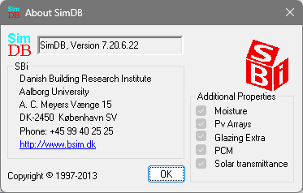

<link rel="stylesheet" href="../style.css">

# About SimDB
Clicking the *About* button shows information about the selected database.

<figure id="center_img">

<figcaption>Dialog showing information about the selected database.</figcaption>
</figure>

Information about additional data, which is available in the current database, is show at the right. Some of this data is necessary to use some facilities in BSim from version 2002 and some of the extension modules:

*   *Moisture* is necessary to simulate moisture conditions in the constructions of the model. Extension module.
*   *Pv Arrays* is necessary to calculate the electrical yield from building integrated solar cells. Extension module for BSim.
*   *Glass temp.* is necessary to perform a detailed simulation of the glass temperature of WinDoor's (BSim).  
*   *PCM* - Phase changing materials
*   *Solar transmittance*
