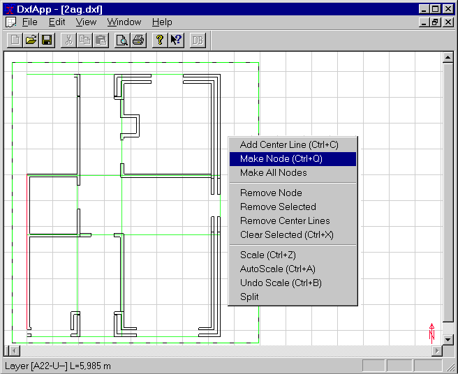

<link rel="stylesheet" href="../style.css">

# SimDXF - Create help lines 

In *SimDXF* crossings between lines in the drawings are chosen as basis for the definition of nodes in the ground plan. Based on the help lines and the nodes spaces are created with a fixed space height.

The following rules for manoeuvring in *SimDXF* counts:
*   Lines/nodes can be SELECTED by Ctrl+click on the line (normally shown as blue lines)
*   An additional click removes the selection (on/off function)
*   Alternatively lines/nodes can be selected by dragging a SQUARE (drag while pressing left mouse button) to cover the desired lines or nodes.
*   Choices of lines/nodes can be rest by pressing Ctrl+X.

The entire drawing can be shown in the window (AutoScale = Ctrl+A), or one can zoom in on a selected area of the drawing (make a mark-up square and Ctrl+Z).

Create *help lines* for the desired walls and constructions.

**For internal walls, the help line is the centrelines (chose the wall faces + Ctrl+C), or make a rectangle containing the lines of the faces + Ctrl+C.**

**For exterior walls the help line must be the exterior face (facing the ambient).**

<figure id="center_img">

<figcaption>Help lines selected in DxfView.</figcaption>
</figure>

See also:
*   [Selecting the DXF filter](../08SimDXF_CAD_drawings_as_basis_for_geometry/08_03_SimDXF_Selecting_the_DXF_filter.md)
*   [Opening a DXF drawing](../08SimDXF_CAD_drawings_as_basis_for_geometry/08_02_SimDXF_Opening_a_DXF_drawing.md)
*   [Creating nodes](../08SimDXF_CAD_drawings_as_basis_for_geometry/08_09_SimDXF_Creating_nodes.md)
*   [Faces](../08SimDXF_CAD_drawings_as_basis_for_geometry/08_05_SimDXF_Faces.md)
*   [Spaces](../08SimDXF_CAD_drawings_as_basis_for_geometry/08_06_SimDXF_Spaces.md)
*   [WinDoor](../08SimDXF_CAD_drawings_as_basis_for_geometry/08_08_SimDXF_WinDoor.md)
*   [Drawing revisions](../08SimDXF_CAD_drawings_as_basis_for_geometry/08_07_SimDXF_Drawing_revisions.md)
*   [Adding SimDXF as an application](../08SimDXF_CAD_drawings_as_basis_for_geometry/08_04_SimDXF_Adding_as_an_application.md)
