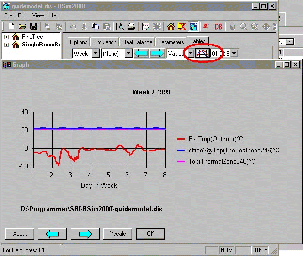

<link rel="stylesheet" href="../style.css">

# tsbi5 graph

<figure id="center_img">

<figcaption>Graph of the hourly values.</figcaption>
</figure>

The graph will change automatically if a new time is chosen.

It is possible to manipulate the graph of the hourly values as described in the section entitled Modifying the graphical presentation of results.

The location of the models is shown at the bottom of the graph. The connection to the different used models is indicated by a preceding *model_name@* (as shown in the figure where results from the actual model (*guidemodel*) are compared model are compared with results from *office2*, (shown in front of each foreign parameter)).

It is possible to fix the maximum, the minimum and the division of the Y-axis from one result period to an other. The dialog for fixing the scale of the Y-axis is revealed by pressing the [Y-scale-button](24_50_Graph_scale.md).

It is possible to manipulate the graphic representation of the results as described in the section "[Modifying the graphical presentation of results](../13tsbi5_thermal_simulation/13_12_Modifying_the_graphical_presentation_of_results.md)".

