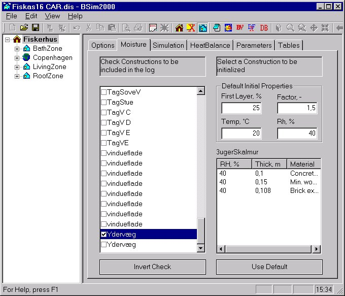

<link rel="stylesheet" href="../style.css">

# tsbi5 - Moisture
The tab Moisture holds different possibilities for defining the options for the moisture part of the simulations of the building constructions.

<figure id="center_img">

<figcaption>In tab "Moisture" the simulation options for the moisture part of the simulations of the building constructions are given.</figcaption>
</figure>

At the left hand side of the dialog an overview of all constructions, defined in thermal zones of the building, is shown. Only constructions defined in thermal zones takes part in the moisture simulations. When a construction is selected in the overview the division into individual material layers are show in the window at the bottom right of the dialog, with layers listed from face side 1 to face side 2. For each layer the initial relative humidity (RH %), the thickness (m) and the building material is shown. A layer will as default have a relative humidity as stated in the boxes at the top right of the dialog (*Default Initial Properties* Rh, %). The values can be changed by clicking RH % of the actual material layer and typing - when the field is highlighted - a new value (integer). The in dated changes of the relative humidity can be reset to the default values by clicking the *Use Default* button.

For each construction in the overview a tick-field exists, which defines if results from that construction is saved on hourly basis during the simulations in tsbi5. For all ticked constructions the relative and the absolute humidity of all layers are saved. **To save theses values a tick-mark in *Constructions* under the *Save in Log* must be set at the *Options* tab.** The status of the tick-fields for all constructions can be inverted by clicking the *Invert Check* button.

*Default Initial Properties* In this group of data is give how the constructions are sub-divided automatically in control volumes during simulation and how the initial conditions are defined.

For a construction material facing a space, a theoretical minimum thickness (dt) of the first control volume. The thickness of the first layer will be a percentage of dt, as given in the field *First Layer*. The thickness of the following layers will be increased successively with a factor until the thickness is equal to *Layer thick* (m), as stated at the *Options* tab. The scaling factor is given in the *Factor* (-) field.

The initial temperature of all constructions is given in the *Temp* field.

The initial relative humidity is given in the *RH* field. This value is used for all constructions, unless an other value is given, as described above.

See also:
*   [Tab *Options* ](../13tsbi5_thermal_simulation/13_02_tsbi5_options.md)
*   [Tab *Simulation* ](../13tsbi5_thermal_simulation/13_04_tsbi5_simulation.md)
*   [Tab *HeatBalance* ](../13tsbi5_thermal_simulation/13_07_tsbi5_HeatBalance.md)
*   [Tab *Parameters* ](../13tsbi5_thermal_simulation/13_08_tsbi5_Parameters.md)
*   [Tab *Tables*](../13tsbi5_thermal_simulation/13_09_tsbi5_Tables.md)

