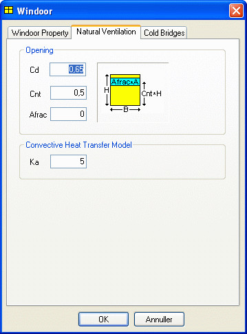

<link rel="stylesheet" href="../style.css">

# Natural ventilation

The module to simulate natural ventilation using the multi-zone model (mzm) is for the time being in beta test and results obtained using this module must, as always, be looked upon with natural skepticism.

Any feed-back to the module given at bsim-support@sbi.dk is appreciated!

 

The tab Natural Ventilation gives access to definition of parameters for the opening/WinDoor to [simulate natural ventilation](../11Systems/11_11_Natural_ventilation.md) (airing) based on differences between indoor and outdoor temperatures as well as wind speed and wind direction.

<figure id="center_img">

<figcaption>2nd tab in the WinDoor property dialog gives access to define parameters for simulating natural ventilation.</figcaption>
</figure>

Opening

*   *Cd*: [Discharge coefficient](../20The_Mathematical_basis/20_15_Parameters_for_Natural_Ventilation.md) determined by the geometry of the WinDoor/opening. Typical values range from 0.62 to 0.7.

*   *Cnt*: Is the geometrical center of the opening (0-1). The center is located in the distance *Cnt*H* above the lower edge of the WinDoor, where H is the total height of the WinDoor.   
*Example*: For a WinDoor with horizontal opening and fixing at the top, the center of the opening will be located approx. 20 % above the bottom of the WinDoor (rectangular, horizontal opening at the bottom and triangular openings at the sides) and the *Cnt*-value is thus 0.2.

*   *Afrac*: Is the part of the actual opening that can be opened. If *Afrac = 0*, the opening can not be opened and thus not contribute to the natural ventilation of the thermal zone.

    *   The sketch at the right of the dialog illustrates BSim's perception of the opening and the input data.

*   *Ka*: The inlet air handling unit box [constant](../20The_Mathematical_basis/20_15_Parameters_for_Natural_Ventilation.md) is used calculation of night cooling by natural ventilation.

